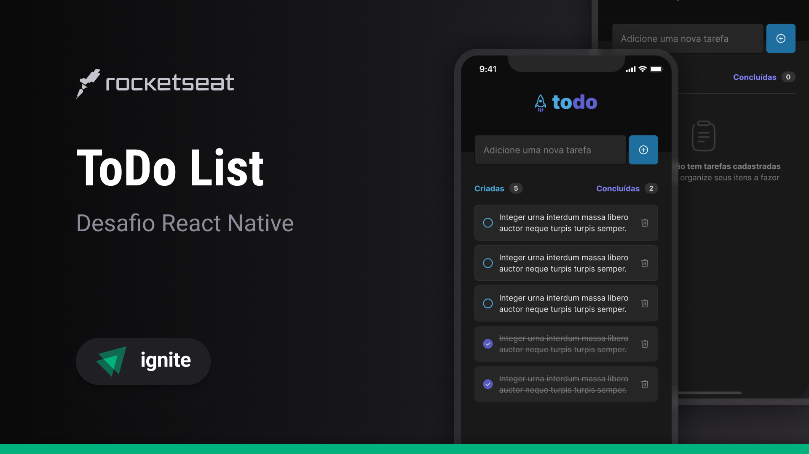

  

## App developed to learn the fundamentals about React Native

---

## 📚 Learning
All the things that I learned and practiced with this project

- I learned `how React Native works`
- I learned `FlatList` to create list of items
- I practice `states` of React to control data
- I learned about `SafeAreaView` to adapt the layout to IOS devices

 

---

## 🧪 Technologies

This project was developed using the following technologies:

- [React Native](https://reactnative.dev/)
- [Typescript](https://www.typescriptlang.org/)
- [Expo](https://expo.dev/)
- [React](https://react.dev/)

 

---

## 🔖 Layout

You can view the project layout through the links below:

- [Layout](<https://www.figma.com/file/1XfZQGSWk4HWjvwcjd2nOP/ToDo-List/duplicate>)

Remembering that you need to have a [Figma](http://figma.com/) account to access it.

 

---

Developed by [ricardorhv](https://github.com/ricardorhv) 🖤
